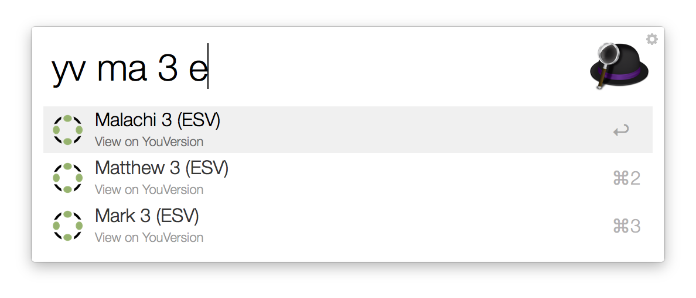

# YouVersion Suggest

*Copyright 2015 Caleb Evans*  
*Released under the MIT license*

YouVersion Suggest is an Alfred workflow which allows you to search the online
[YouVersion](https://www.youversion.com/) bible quickly and conveniently.

## Usage

### Filtering by reference

To filter the YouVersion Bible by reference, type the `yvfilter` keyword into
Alfred, followed by a space and a phrase representing the bible reference you
wish to find. The phrase can be part of a book name, chapter, verse, or range of
verses. You may also include an optional version (translation) at the end of
your query. As you type, YouVersion Suggest will display a list of suggestions
matching your query.

**Pro Tip:** Type `yvf` and press the *tab* key to quickly filter by reference
(as this will expand to `yvfilter`).

Choosing a result will open the selected reference on the YouVersion website.
Choosing a result while holding down the *command* key will copy the contents of
the selected reference to the clipboard. Choosing a result while holding down
the *ctrl* key will open a Google search for the selected reference.

Pressing *Command-C* when choosing a result will copy the respective reference
identifier, such as *1 Corinthians 13:4-7 (ESV)*, to the clipboard. Pressing
*Command-L* when choosing a result will show the respective reference identifier
as Alfred Large Type.

#### Example queries

* `yvfilter luke` => Luke
* `yvfilter eph 3` => Ephesians 3
* `yvfilter 1t3e` => 1 Thessalonians 3 (ESV), 1 Timothy 3 (ESV)
* `yvfilter mat 6:34 nlt` => Matthew 6:34 (NLT)
* `yvfilter 1 co 13.4-7` => 1 Corinthians 13:4-7
* `yvfilter relevations 7` => Revelation 7

### Searching by content

You can also search the YouVersion Bible by content using the `yvsearch`
keyword. As you type, YouVersion Suggest will display Bible verses whose content
contains your given keywords.

Note that when using the `yvsearch` filter, YouVersion Suggest will only search
for verses in your preferred version. To learn more about setting your preferred
version in YouVersion Suggest, see *Setting your preferred version*.

#### Example queries

* `yvsearch without faith` => Hebrews 11:6
* `yvsearch do not worry` => Matthew 6:34

### Setting your preferred language

YouVersion Suggest allows you to change the languages used for Bible references
and versions. To do so, type `yvset language` into Alfred, and the list of
supported languages will then appear. You may then choose another language to be
your preferred language.

Currently, YouVersion Suggest supports the following languages:

* English (en)
* Spanish (es)
* Spanish - Spain (es-ES)
* French (fr)
* German (de)
* Italian (it)
* Dutch (nl)
* Swedish (sv)
* Finnish (fi)
* Simplified Chinese (zh-CN)
* Japanese (ja)
* Korean (ko)
* Hindi (hi)
* Portuguese - Brazil (pt)
* Portuguese - Portugal (pt-PT)
* Russian (ru)
* Arabic (ar)

If you would like support added for another language, please [submit an issue on
GitHub](https://github.com/caleb531/youversion-suggest/issues) with the following
details:

1. The name of the language (*e.g.* Simplified Chinese)
2. If possible, the language's ISO 639-1 code (*e.g.* zh-CN)
3. The name of the YouVersion-supported Bible version to use as the default for
this language. See [this list](https://www.bible.com/versions) for all of the
versions that YouVersion supports.

### Setting your preferred version

You may also set your preferred version (translation) used for Bible references
(where you have not explicitly specified the version in the query). To do so,
type `yvset version` into Alfred, and the list of supported versions (for the
currently-set language) will appear.

To select a version from the list of versions more quickly, you may optionally
type a query after the initial query to filter the list of versions.

#### Example queries

* `yvset version esv`
* `yvset version a`
