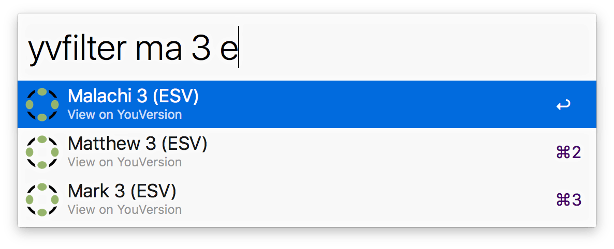
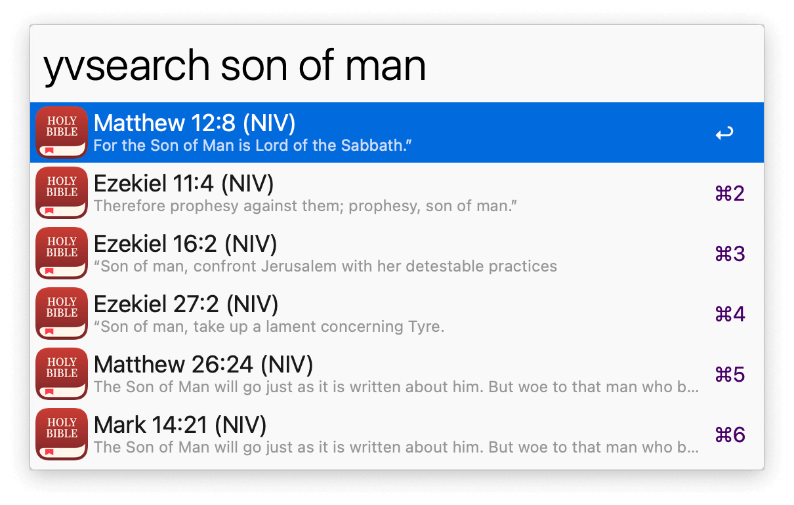

# YouVersion Suggest

*Copyright 2014-2022 Caleb Evans*  
*Released under the MIT license*

YouVersion Suggest is an [Alfred](https://www.alfredapp.com/) workflow which
allows you to search the online [YouVersion](https://www.youversion.com/) Bible
quickly and conveniently.

The workflow will be solely supporting Alfred 5 going forward, but the latest
releases for Alfred 4 and earlier will remain available here for your
convenience.

## Usage

### Filtering by reference

The `yvfilter` keyword allows you to filter the YouVersion Bible by reference,
meaning you can jump to a particular Bible reference (book, chapter, verse, or
range of verses) with just a few keystrokes.

**Pro Tip:** Type `yvf` and press the `tab` key to quickly filter by reference
(as this will expand to `yvfilter`).

#### Example queries

- `yvfilter luke` => Luke
- `yvfilter eph 3` => Ephesians 3
- `yvfilter 1t3es` => 1 Thessalonians 3 (ESV), 1 Timothy 3 (ESV)
- `yvfilter mat 6:34 nlt` => Matthew 6:34 (NLT)
- `yvfilter 1 co 13.4-7` => 1 Corinthians 13:4-7
- `yvfilter relevations 7` => Revelation 7

#### Actions

- Choosing a result will open the Bible reference on the YouVersion website

- Choosing a result while pressing `command` will copy the contents of the Bible
reference to the clipboard

- Choosing a result while pressing `ctrl` will open a Google search for the
Bible reference.

- Pressing `shift` while a result is selected will preview the contents of the
Bible reference without leaving the search results (new in v6.1.0)

- Pressing `command-c` while a result is selected will copy to the clipboard the
full Bible reference identifier, such as *1 Corinthians 13:4-7 (ESV)*

- Pressing `command-l` while a result is selected will show the full Bible
reference identifier as Large Type

### Searching by content

You can also search the YouVersion Bible by content using the `yvsearch`
keyword. As you type, YouVersion Suggest will display Bible verses whose content
contains your given keywords.

Note that when using the `yvsearch` filter, YouVersion Suggest will only search
for verses in your preferred version. To learn more about setting your preferred
version in YouVersion Suggest, see *Setting your preferred version*.

#### Example queries

- `yvsearch without faith` => Hebrews 11:6
- `yvsearch do not worry` => Matthew 6:34

#### Actions

You can perform all the same actions on a result with `yvsearch` as you can with
`yvfilter`.

### Setting your preferred language

YouVersion Suggest allows you to change the languages used for Bible references
and versions. To do so, type `yvset language` into Alfred, and the list of
supported languages will then appear. You may then choose another language to be
your preferred language.

Currently, YouVersion Suggest supports the following languages:

- Arabic (arb)
- Bulgarian (bul)
- Dutch (nld)
- Chinese - Simplified (zho)
- Chinese - Traditional (zho-TW)
- English (eng)
- Finnish (fin)
- French (fra)
- German (deu)
- Hindi (hin)
- Indonesian (ind)
- Italian (ita)
- Japanese (jpn)
- Khmer (khm)
- Korean (kor)
- Persian (pes)
- Polish (pol)
- Portuguese (por)
- Portuguese - Portugal (por-PT)
- Russian (rus)
- Spanish (spa)
- Spanish - Spain (spa-ES)
- Swahili (swh)
- Swedish (swe)
- Vietnamese (vie)

### Setting your preferred version

You may also set your preferred version (translation) used for Bible references
(where you have not explicitly specified the version in the query). To do so,
type `yvset version` into Alfred, and the list of supported versions (for the
currently-set language) will appear.

**Pro Tip:** Type `yvset v` and press the `tab` key to quickly see the list of
available versions to set (as this will expand to `yvset version`).

To select a version from the list of versions more quickly, you may optionally
type a query after `yvset version` to filter the list of versions.

#### Example queries

- `yvset version esv` => ESV
- `yvset version a` => AMP

### Setting your preferred search engine

You may also set your preferred search engine used for searching selected Bible
references. To do so, open the YouVersion Suggest workflow in Alfred Preferences
and double-click the *Default Web Search* object. You can then choose a search
engine to set as your preferred for YouVersion Suggest.

### Showing verse numbers in copied Bible content

You can choose whether or not to include verse numbers in copied Bible verses by
typing `yvset versenumbers yes`.

### Making "Copy to Clipboard" the default action

If you would prefer to just press `Enter` (without holding down the `command`
key) to copy the content of a Bible reference, type `yvset copybydefault yes`.
When this is enabled, you can still open the selected reference on the
YouVersion website by holding down the `command` key.

## Disclaimer

This project is not affiliated with YouVersion, and all Bible content is
copyright of the respective publishers.
