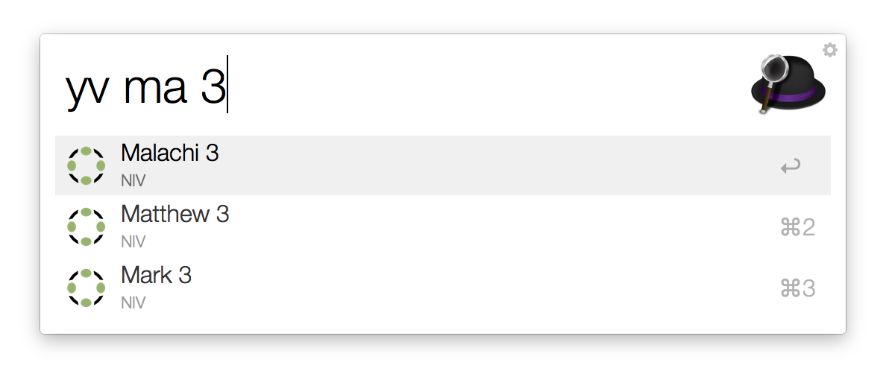

# YouVersion Suggest

*Copyright 2015 Caleb Evans*  
*Released under the MIT license*

YouVersion Suggest is an Alfred workflow which allows you to search the online
[YouVersion](https://www.youversion.com/) bible quickly and conveniently.



## Usage

Type the `yv` keyword, followed by a space and a phrase representing the bible
reference you wish to find. The phrase can be part of a book name, chapter,
verse, or range of verses. You may also include an option version (translation)
at the end of your query. As you type, YouVersion Suggest will display a list of
suggestions matching your query.

Choosing a result will open the selected reference on the YouVersion website.
Choosing a result while holding down the *ctrl* key will open a Google
search for the selected reference.

### Query Examples

* `luke` => Luke
* `eph 3` => Ephesians 3
* `1t3e` => 1 Thessalonians 3 (ESV), 1 Timothy 3 (ESV)
* `mat 6:34 nlt` => Matthew 6:34 (NLT)
* `1 co 13.4-7` => 1 Corinthians 13:4-7

### Supported versions

#### English

AMP, ASV, BOOKS, CEB, ESV, GNT, KJV, MSG, NASB, NCV, NET, NIRV, NIV, NIVUK,
NKJV, NLT

YouVersion Suggest defaults to NIV, however you can always specify your
preferred version when searching for a reference.

## Testing

### Requirements for running tests

Running these unit tests requires Python 2.7, as well as the following packages
to be installed:

* nose
* coverage
* pep8

If you do not have these packages installed already, you can install them via
`pip`:

```
sudo pip install nose coverage pep8
```

### Running tests

To run the included unit tests, run the `nosetests` command within the project
directory.

```
nosetests
```

### Viewing test coverage

To view the test coverage report, run `nosetests` with the `--with-coverage` and
`--cover-erase` flags.

```
nosetests --with-coverage --cover-erase
```
